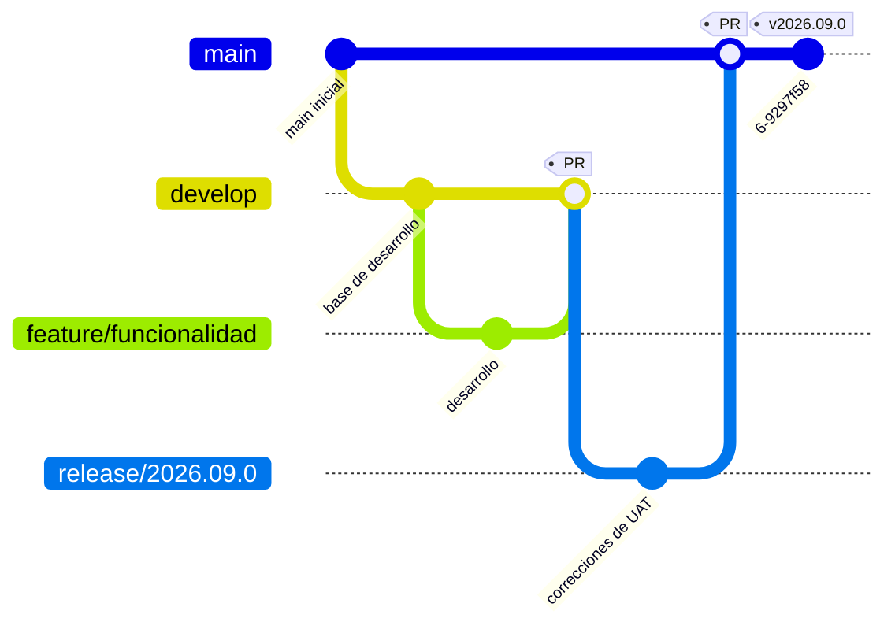
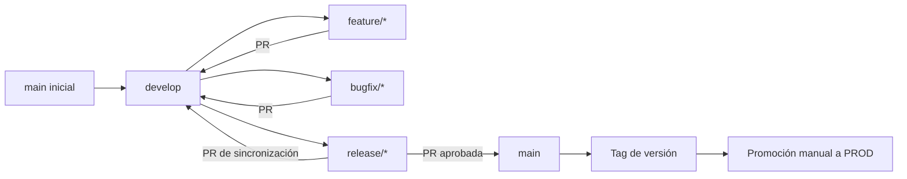
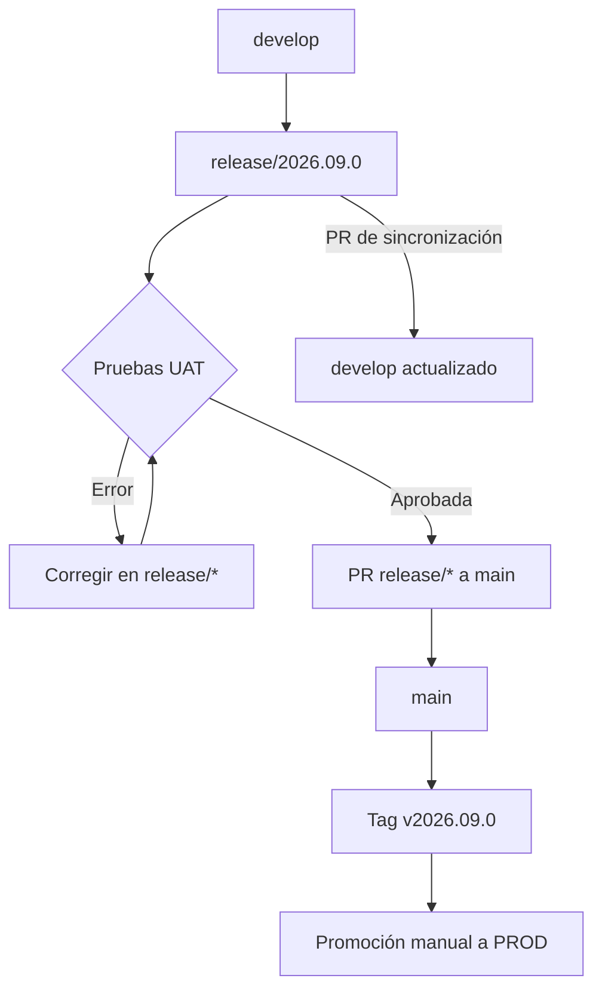
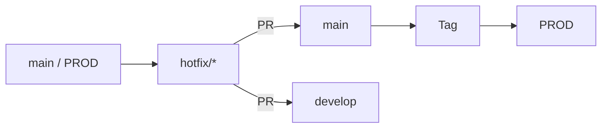

# Estrategia de branching

## Objetivo

Este documento define el flujo mínimo de ramas para el MVP de ALM de Power Platform y Finance & Operations.

El objetivo es separar:

- el código actualmente aprobado para producción;
- el trabajo que se está preparando para una próxima versión;
- el desarrollo de funcionalidades y correcciones;
- la preparación y validación de una entrega.

Para este MVP usaremos:

- dos ramas permanentes: `main` y `develop`;
- ramas temporales para funcionalidades, correcciones y releases;
- promoción manual entre ambientes.

> La rama Git no es el ambiente. Una rama representa una línea de cambios; el despliegue a DEV, QA, UAT o PROD se realiza manualmente según el procedimiento de promoción.

## Concepto principal

```text
main    = versión aprobada para PROD
 develop = próxima versión en construcción
```

La relación entre ambas ramas es:

```text
main
  │
  └── se crea una sola vez
          ▼
       develop
```

Después de crear `develop`, el flujo normal de trabajo parte de `develop`. No se vuelve a crear `develop` cada vez que se hace una release.

## Árbol general

El flujo normal es el siguiente:



La misma idea, en forma de árbol:

```text
main ────────────────────────────────────────────────●── v2026.09.0 ── PROD
  \                                                /
   \                                              /
    └── develop ──●──────────────────────────────┘
          \       \
           \       └── release/2026.09.0 ── PR ──> main
            \
             ├── feature/* ── PR ──> develop
             │
             └── bugfix/*  ── PR ──> develop
```

Una vez creada una release, las correcciones de esa release deben llegar a los dos destinos:

```text
                         ┌── PR ──> main ──> tag ──> PROD
release/2026.09.0 ───────┤
                         └── PR ──> develop
```

Esto es necesario porque una corrección hecha durante QA o UAT puede existir únicamente en `release/*`.

## Ramas permanentes

### `main`

Representa el código aprobado para producción.

Reglas:

- No se trabaja directamente en `main`.
- No se hacen pushes directos.
- Solo recibe cambios mediante PR desde `release/*` o `hotfix/*`.
- Cada versión productiva debe tener un tag, por ejemplo `v2026.09.0`.

### `develop`

Representa la próxima versión en construcción.

Reglas:

- Las ramas `feature/*` y `bugfix/*` nacen desde `develop`.
- Los cambios terminados llegan a `develop` mediante PR.
- `develop` es la base para la integración y las pruebas de QA.
- Puede contener cambios que todavía no están en producción.
- No debe recibir pushes directos.

## Ramas temporales

| Tipo | Se crea desde | Propósito | Destino principal | Ejemplo |
|---|---|---|---|---|
| `feature/*` | `develop` | Nueva funcionalidad | `develop` | `feature/customer-approval` |
| `bugfix/*` | `develop` | Corrección encontrada antes de PROD | `develop` | `bugfix/fix-invoice-validation` |
| `release/*` | `develop` | Preparar una versión para PROD | `main` y `develop` | `release/2026.09.0` |
| `hotfix/*` | `main` | Corrección urgente ya existente en PROD | `main` y `develop` | `hotfix/2026.09.1` |

Las ramas temporales se eliminan después de completar sus PRs y terminar la promoción correspondiente.

## Creación inicial de las ramas

Al comenzar, normalmente solo existe `main`. `develop` se crea una única vez desde `main`:

```bash
git clone https://dev.azure.com/{organization}/{project}/_git/{repo}
cd {repo}

git fetch origin
git switch main
git pull origin main

git switch -c develop
git push -u origin develop
```

El resultado inicial es:

```text
main
  │
  └── develop
```

A partir de ese momento, no se crean ramas permanentes adicionales para cada funcionalidad. Las ramas temporales se crean y eliminan según la necesidad.

## Orden del flujo normal

El orden recomendado es:

```text
1. main
      │
      └── crear develop una sola vez

2. develop
      │
      ├── crear feature/* para nuevas funcionalidades
      └── crear bugfix/* para correcciones previas a PROD

3. feature/* o bugfix/*
      │
      └── desarrollar, probar en DEV y crear PR hacia develop

4. develop
      │
      └── integrar todos los cambios de la entrega y validar en QA

5. release/*
      │
      └── crear desde develop y validar en UAT

6. release/*
      │
      ├── si hay errores, corregirlos en release/*
      └── si está aprobada, crear PR hacia main

7. main
      │
      └── crear tag y promover manualmente a PROD

8. release/*
      │
      └── crear PR hacia develop para devolver las correcciones de la release
```

## Flujo de una nueva funcionalidad: `feature/*`

Una funcionalidad nueva siempre parte de `develop`.

```text
develop
   │
   └── feature/customer-approval
           │
           ├── desarrollo y pruebas en DEV
           │
           └── PR ──> develop
```

### Ejemplo

```bash
git switch develop
git pull origin develop
git switch -c feature/customer-approval

# Desarrollar, exportar/versionar la solución y probar en DEV

git add .
git commit -m "Add approval flow for purchase requests"
git push -u origin feature/customer-approval
```

Después:

1. Crear PR de `feature/customer-approval` hacia `develop`.
2. Adjuntar evidencia de pruebas en DEV.
3. Revisar y aprobar el PR.
4. Completar el PR.
5. Eliminar `feature/customer-approval`.
6. Validar `develop` en QA.

La rama `feature/*` no continúa hacia `main` directamente. El cambio llega a producción como parte de una `release/*`.

## Flujo de una corrección antes de producción: `bugfix/*`

Un `bugfix/*` se usa cuando el defecto se encuentra en DEV, QA o UAT y todavía no es un incidente de producción.

```text
develop
   │
   └── bugfix/fix-invoice-validation
           │
           └── PR ──> develop
                         │
                         └── release/* ──> main ──> PROD
```

### Ejemplo

```bash
git switch develop
git pull origin develop
git switch -c bugfix/fix-invoice-validation

# Corregir y probar en DEV

git add .
git commit -m "Fix vendor invoice validation"
git push -u origin bugfix/fix-invoice-validation
```

Después:

1. Crear PR de `bugfix/fix-invoice-validation` hacia `develop`.
2. Adjuntar evidencia del defecto y de la corrección.
3. Completar el PR después de la revisión.
4. Eliminar la rama `bugfix/*`.
5. Validar en QA.
6. Incluir el cambio en la siguiente `release/*`.

## Flujo de una release: `release/*`

Una `release/*` se crea cuando `develop` contiene todos los cambios que se desean incluir en una entrega.

```text
develop
   │
   └── release/2026.09.0
```

La release congela el alcance de la entrega. Después de crearla:

- no se agregan funcionalidades nuevas;
- solo se corrigen errores necesarios para esa versión;
- la validación final se realiza sobre la release;
- la promoción a producción sale de la release integrada en `main`.

### Crear la release

```bash
git switch develop
git pull origin develop
git switch -c release/2026.09.0
git push -u origin release/2026.09.0
```

### Validar la release

```text
release/2026.09.0
        │
        ├── QA técnico
        ├── UAT funcional
        └── correcciones necesarias en la misma release
```

## ¿Qué pasa si hay errores en la release?

Si QA o UAT encuentra un error, **no se vuelve normalmente a la rama `feature/*`**.

La funcionalidad ya fue integrada en `develop` y la rama temporal probablemente ya fue eliminada. Además, el error puede ser de integración entre varios cambios.

La corrección se hace directamente en `release/*`:

```text
release/2026.09.0
        │
        └── corregir error
                │
                ├── probar nuevamente en QA/UAT
                └── continuar hacia main cuando esté aprobada
```

Ejemplo:

```bash
git switch release/2026.09.0
git pull origin release/2026.09.0

# Corregir el error encontrado en UAT

git add .
git commit -m "Fix approval validation found in UAT"
git push origin release/2026.09.0
```

La corrección queda inicialmente solo en `release/2026.09.0`. Por eso, al finalizar, la release debe integrarse en ambos destinos:

```text
release/2026.09.0 ── PR ──> main
release/2026.09.0 ── PR ──> develop
```

## Llevar la release a producción

Cuando UAT aprueba la release:

1. Crear PR de `release/2026.09.0` hacia `main`.
2. Obtener las aprobaciones requeridas.
3. Completar el PR.
4. Crear el tag `v2026.09.0` sobre `main`.
5. Promover manualmente `main` o el commit etiquetado a PROD.
6. Crear PR de `release/2026.09.0` hacia `develop`.
7. Completar el PR hacia `develop`.
8. Eliminar la rama `release/2026.09.0`.

El flujo es:

```text
release/2026.09.0
        │
        ├── PR ──> main ──> tag v2026.09.0 ──> PROD
        │
        └── PR ──> develop
```

## ¿Por qué hay que integrar la release también en `develop`?

Porque `develop` y `main` tienen objetivos diferentes:

```text
main    = lo que está en PROD
develop = lo que se prepara para el futuro
```

Cuando se crea `release/2026.09.0`, inicialmente nace desde `develop`. Si no se hacen correcciones durante UAT, ambas ramas pueden contener el mismo código en ese momento.

Pero si se corrige un error en la release, el cambio queda así:

```text
develop ────────────────●─────────────── próximo desarrollo
                          \
release/2026.09.0 ──────────●── corrección de UAT
                              \
main ─────────────────────────●── PROD
```

La corrección existe en `main`, pero no necesariamente en `develop`. Por eso se hace:

```text
release/2026.09.0 → develop
```

No se copia `develop` hacia `main`, porque `develop` puede contener funcionalidades futuras todavía no aprobadas para producción.

## Flujo urgente de producción: `hotfix/*`

Un `hotfix/*` se usa únicamente cuando el problema ya está en PROD y no puede esperar a la siguiente release.

Un hotfix nace desde `main`, no desde `develop`:

```text
main / PROD
     │
     └── hotfix/2026.09.1
```

### Ejemplo

```bash
git switch main
git pull origin main
git switch -c hotfix/2026.09.1

# Aplicar únicamente la corrección urgente y probarla

git add .
git commit -m "Fix production approval notification"
git push -u origin hotfix/2026.09.1
```

Después:

1. Crear PR de `hotfix/2026.09.1` hacia `main`.
2. Obtener la revisión prioritaria.
3. Completar el PR.
4. Crear el tag `v2026.09.1` sobre `main`.
5. Promover manualmente a PROD.
6. Crear PR de `hotfix/2026.09.1` hacia `develop`.
7. Completar el PR hacia `develop`.
8. Eliminar la rama `hotfix/*`.

El flujo es:

```text
main / PROD
     │
     └── hotfix/2026.09.1
             │
             ├── PR ──> main ──> tag ──> PROD
             │
             └── PR ──> develop
```

## Regla para decidir qué rama usar

```text
¿Es una nueva funcionalidad?
    Sí → feature/* desde develop

¿Es un defecto encontrado antes de PROD?
    Sí → bugfix/* desde develop

¿La funcionalidad/corrección ya está en develop y se prepara una entrega?
    Sí → release/* desde develop

¿El defecto ya está en PROD y es urgente?
    Sí → hotfix/* desde main
```

## Reglas de integración

1. `feature/*` solo se integra hacia `develop`.
2. `bugfix/*` solo se integra hacia `develop`.
3. `release/*` se integra hacia `main` y hacia `develop`.
4. `hotfix/*` se integra hacia `main` y hacia `develop`.
5. No se integra directamente `feature/*` o `bugfix/*` hacia `main`.
6. Si hay errores en una release, se corrigen en `release/*`.
7. Las correcciones hechas en `release/*` deben llegar también a `develop`.
8. Las correcciones hechas en `hotfix/*` deben llegar también a `develop`.
9. No se agregan funcionalidades nuevas a `release/*`.
10. No se hacen pushes directos a `main` ni a `develop`.

## Reglas generales

1. Proteger `main` y `develop`.
2. Prohibir pushes directos a ambas ramas.
3. Requerir al menos una aprobación para cambios normales.
4. Requerir dos aprobaciones para producción cuando el equipo lo permita.
5. Resolver conversaciones y checks antes de completar el PR.
6. Preferir **Squash merge** para mantener un historial sencillo.
7. Eliminar ramas temporales después del merge.
8. Etiquetar versiones productivas con el formato `vYYYY.MM.patch`, por ejemplo `v2026.09.0`.
9. No reutilizar una rama temporal después de completar su PR.
10. Asociar cada cambio con un work item de Azure Boards cuando sea posible.

## Resumen visual final

### Entrega normal



### Release con error encontrado en UAT



### Hotfix


